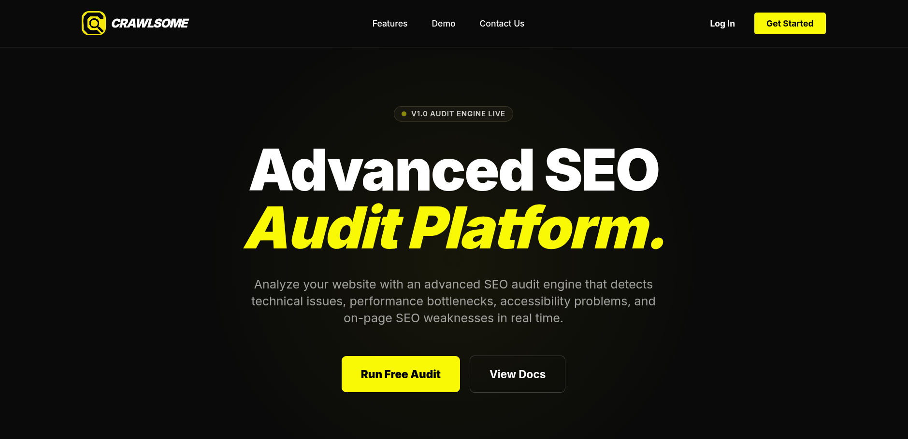

# Crawlsome - SEO Audit Platform

---
## Note

For confidenciality reasons, the repositories containing the code are made private. 
---

## Overview
SEO Audit Platform is a web application designed to help website owners, developers, and digital marketers identify technical and on-page SEO issues that may affect search engine visibility and overall website performance.

The platform performs automated audits on submitted websites and generates actionable recommendations based on industry-standard SEO best practices. By consolidating multiple SEO checks into a single report, users can quickly discover optimization opportunities and improve their website's search engine ranking potential.

---

## Objectives

* Automate technical and on-page SEO analysis.
* Detect common SEO issues affecting website visibility.
* Provide actionable recommendations for each detected problem.
* Present audit results through an intuitive dashboard.
* Offer a scalable architecture capable of supporting future SEO checks and integrations.

---

## Features

### Website Auditing

Users can submit a website URL to initiate an SEO audit. The system crawls the page and extracts relevant SEO and performance information.

### SEO Checks

The platform currently evaluates multiple SEO factors, including:

* Missing or duplicate page titles
* Title length validation
* Missing or poorly optimized meta descriptions
* Heading structure analysis
* Missing image alternative text
* Broken internal and external links
* Thin content detection
* Canonical tag validation
* Noindex directive detection
* Core Web Vitals monitoring

  * Largest Contentful Paint (LCP)
  * Cumulative Layout Shift (CLS)
* Page performance evaluation

### Recommendation Engine

Each detected issue is linked to a predefined recommendation containing:

* A human-readable explanation
* The SEO impact of the issue
* Suggested remediation steps
* Priority level

### Audit History

Users can access previously generated reports and track improvements over time.

---

## System Architecture

The platform follows a modular architecture composed of multiple layers:

### Frontend

Responsible for:

* User authentication
* Audit creation
* Report visualization
* Dashboard interactions

### Backend API

Handles:

* Audit orchestration
* Website crawling
* SEO rule execution
* Recommendation generation
* Data persistence

### Audit Engine

A dedicated service responsible for:

* Fetching website content
* Extracting metadata
* Running SEO validation rules
* Aggregating audit results

### Database

Stores:

* Users
* Audit reports
* SEO checks
* Recommendation rules
* Historical audit data

---

## Technical Challenges

During development, several challenges were addressed:

### Website Crawling Reliability

Different websites use varying HTML structures, JavaScript rendering strategies, and security configurations. The crawler had to be designed to handle these inconsistencies gracefully.

### Rule Extensibility

The audit engine was built with extensibility in mind, allowing new SEO rules to be added without requiring significant architectural changes.

### Performance Optimization

Running multiple SEO validations efficiently while maintaining acceptable response times required careful optimization of the audit workflow.

### Recommendation Mapping

Creating meaningful and actionable recommendations for each SEO issue required designing a flexible recommendation system capable of evolving as new audit rules are introduced.

---

## Results

The platform successfully automates the identification of common SEO issues and provides users with structured recommendations to improve website quality, accessibility, performance, and search engine visibility.

By combining technical analysis, performance metrics, and security checks into a single workflow, the application offers a comprehensive overview of a website's SEO health.

---

## Demo Video

---

## Future Improvements

Planned enhancements include:

* Multi-page website crawling
* Keyword analysis
* Backlink analysis
* Competitor benchmarking
* Scheduled automated audits
* PDF report generation
* SEO score calculation
* AI-powered recommendation generation
* Integration with Google Search Console
* Integration with Google Analytics

---

## Key Learnings

This project provided practical experience in:

* Web crawling and content extraction
* Search Engine Optimization principles
* Backend architecture design
* Database modeling
* API development
* Performance analysis
* Security integration
* Building scalable rule-based systems

---

## Conclusion

SEO Audit Platform demonstrates how automated analysis can simplify technical SEO evaluation and make optimization recommendations accessible to a broader audience. The project combines web crawling, rule-based analysis, performance monitoring, and security validation into a unified platform designed to help websites achieve better search engine visibility and user experience.
